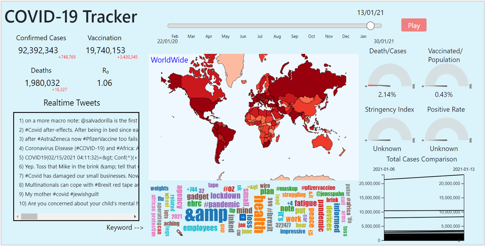

# Covid-19 Dashboard

## Introduction
The Covid-19 outbreak, which was first reported in Wuhan in December 2019, has spread to many countries outside mainland China. As the pandemic has spread across the globe, the virus has left a trail of deaths in its wake. The recent spikes of Covid-19 cases have inspired us to create a dashboard to visualize the trends of various locations in a timely manner. We intend to create a dashboard to better identify the hotspots and compare trends in different locations.

In this project, we downloaded the dataset from https://ourworldindata.org/coronavirus-source-data, which is the official Covid-19 dataset that maintained by Our World in Data. The data is updated daily and records the latest situation worldwide. The dataset downloaded contains the data from 1 January 2020 to 30 January 2021. 

## Dashboard

## Note
The dashboard created is using html for design, php for Twitter API, and Javascript for d3 interactive data visualization. Please use XAMPP to reproduce the dashbaord. 

For the Twitter access, please provide your own tokens at js/queryTwitter.php.

If you have any inquiries, please email me, Liong Gen Bing at genbing67@gmail.com or the collaborators, Ngiu Jin Tian Ci (j1nngiu@gmail.com) and Leow Yen Siang (yensiang99@hotmail.com).
